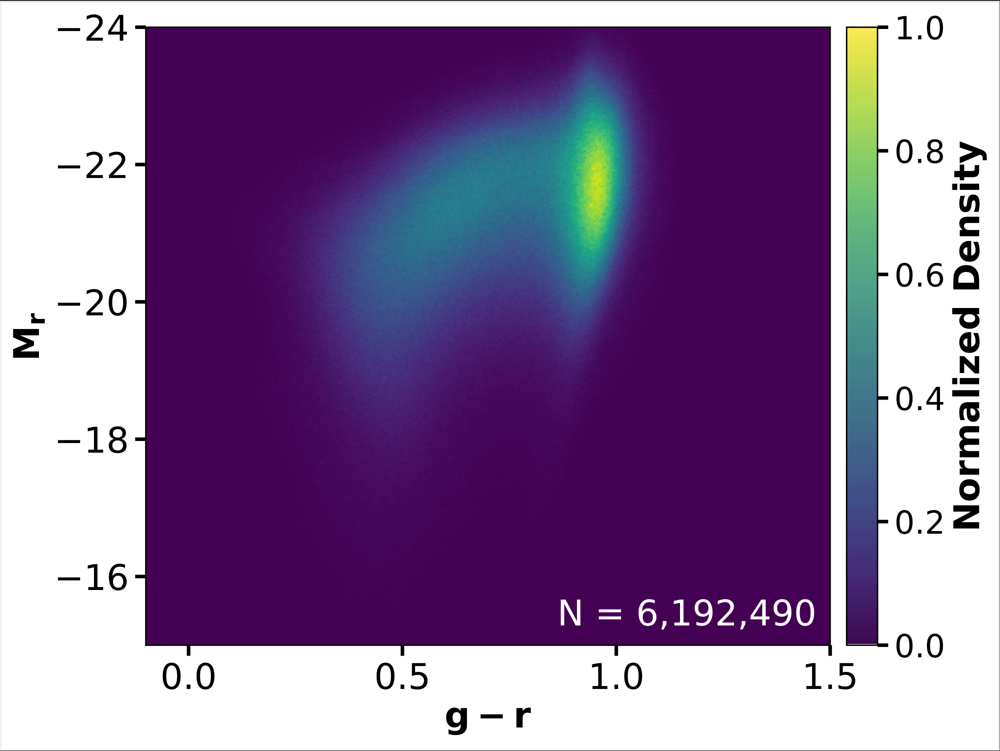
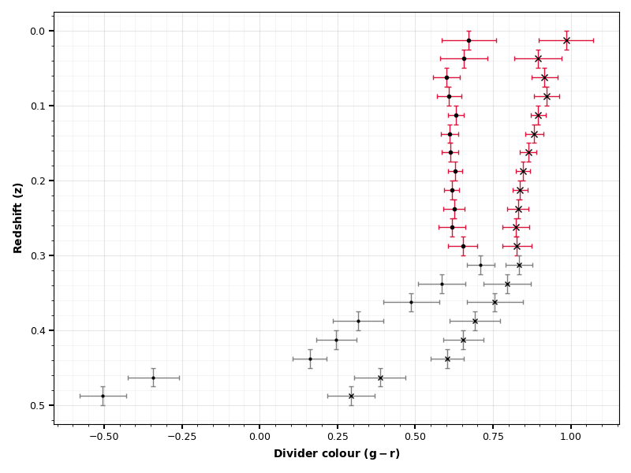
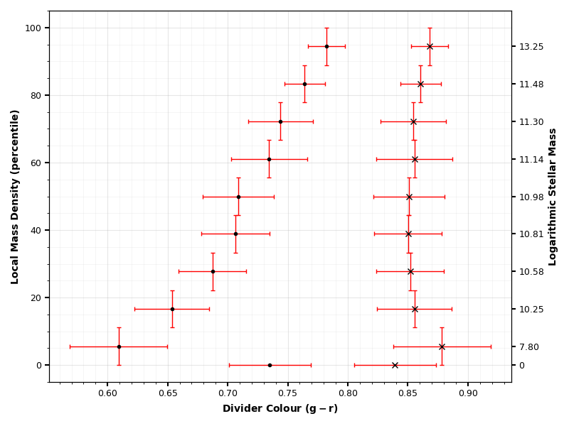
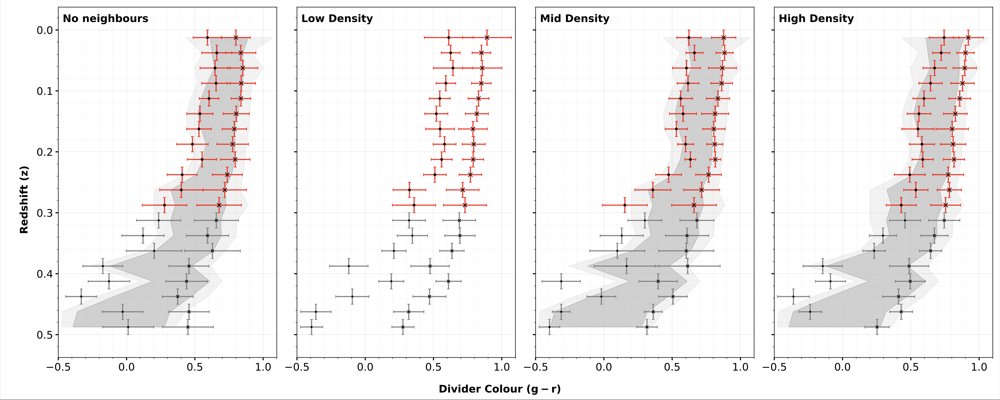
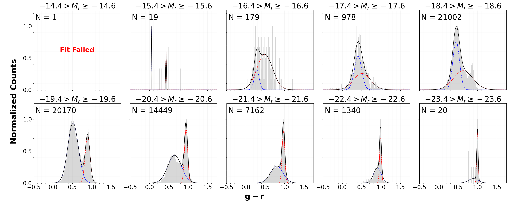
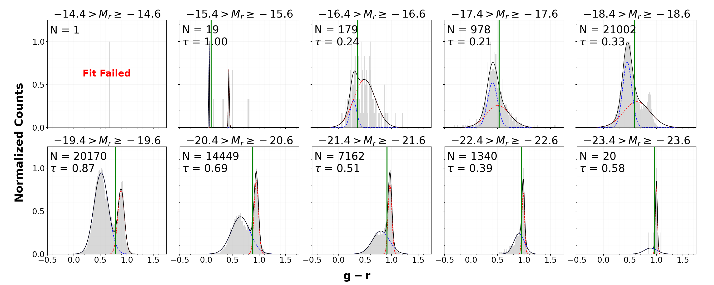

# Modeling Galaxy Evolution as a Function of Cosmic Time and Local Environment

**Author:** Suhas Reddy  
**Advisor:** Dr. Barbara Ryden  
**Project type:** Undergraduate honors thesis / large-scale survey analysis / statistical modeling  

This repository contains public analysis code, selected figures, and methodology notes for a project studying how galaxy populations change across cosmic time and local environment using data from the DESI Bright Galaxy Survey.

The project analyzes a cleaned sample of approximately **6.2 million galaxies** and measures the statistical boundary between two major galaxy populations: **blue, star-forming galaxies** and **red, quiescent galaxies**. In astronomy, the transition region between these populations is commonly called the **green valley**.

The technical goal of this project is to convert a large observational survey catalog into a repeatable statistical workflow for measuring how the blue/red galaxy population boundary changes with redshift, luminosity, and local environment.

Figure 1 below shows the main structure this project models.

<p align="center">
  
</p>

<p align="center">
  <sub><strong>Figure 1.</strong> Color-magnitude diagram for the galaxy sample, shown as a normalized 2D density distribution. Galaxy color is shown on the horizontal axis and intrinsic brightness on the vertical axis. The blue sequence appears as a dense region on the left, while the red sequence appears as a dense region on the right. The transition region between the two populations, where there is a relative deficit of galaxies, is the green valley.</sub>
</p>

___

## Project Summary

Galaxies are not distributed randomly in color-magnitude space. They tend to separate into two broad groups:

- **Blue galaxies:** systems that are typically still forming stars and contain younger stellar populations
- **Red galaxies:** systems that are typically older and less actively star-forming

The space between these groups is known as the **green valley**. Galaxies in this region are often interpreted as systems that are in the process of shutting down star formation through a process called **quenching**. Measuring the green valley is therefore a way to study how galaxy populations change over time.

A major question in extragalactic astronomy is what causes quenching. It may be driven by internal galaxy properties, local environment, cosmic time, or some combination of these factors. By measuring how the green-valley boundary changes with redshift and environment, this project tests which factors are most strongly associated with that transition.

This project constructs a statistical green-valley divider using repeated two-component fits to galaxy color distributions. The divider is tracked across:

- **Redshift:** used as a proxy for cosmic time, where redshift values increase as you go further back in time
- **Absolute magnitude:** a measure of intrinsic galaxy brightness
- **Local environment:** total stellar mass within a 2 Mpc* radius around each galaxy

The public version of this repository emphasizes the analysis workflow, statistical methodology, and selected results. Raw survey catalogs and large intermediate data products are not included.

<sub>*1 Mpc, or one megaparsec, is approximately 3.26 million light-years.</sub>

___

## Technical Project Design

This project is structured as a large-scale statistical analysis pipeline developed and run on **NERSC Perlmutter**. The workflow turns a multi-million-object survey catalog into binned population measurements that can be compared across cosmic time and local environment.

The analysis has four main stages:

1. **Catalog filtering and feature construction**  
   The input data are organized as a galaxy-level catalog, where each row represents one galaxy and each column represents an observed or derived property. The analysis uses redshift, rest-frame color, absolute magnitude, stellar mass, and local-neighborhood measurements to construct the working feature set.

2. **Binned population modeling**  
   The sample is divided across redshift, luminosity, and environment bins. Within each bin, the galaxy color distribution is modeled as a two-component distribution representing the blue and red populations.

3. **Adaptive divider selection**  
   Instead of applying a fixed color cutoff, the green-valley divider is selected separately in each bin using a completeness-reliability objective. This makes the divider responsive to changes in galaxy population structure across redshift, luminosity, and environment.

4. **Trend analysis and validation**  
   The resulting divider measurements are compared across bins to quantify population-level trends. Diagnostic figures are used to inspect fit quality, divider placement, and consistency across the analysis grid.

___

## Key Results

### 1. Evolution with Redshift

The green-valley divider changes with redshift, indicating that the boundary between blue and red galaxy populations evolves over cosmic time.

At higher redshift, the divider is generally redder. Equivalently, the boundary shifts blueward toward the present day. The size of this shift depends on galaxy luminosity.

<p align="center">
  
</p>

<p align="center">
  <sub><strong>Figure 2.</strong> Evolution of the green-valley divider with redshift. The plot shows how the fitted green valley divider changes across cosmic time and luminosity. The trend indicates that the divider is not fixed: it evolves with redshift and depends on intrinsic brightness.</sub>
</p>

___

### 2. Dependence on Local Environment

At fixed redshift, galaxies in denser environments show a redder divider than galaxies in lower-density environments. This effect is stronger for lower-luminosity galaxies and weaker for more luminous galaxies.

This suggests that local environment plays a measurable role in galaxy population evolution, especially for smaller systems.

<p align="center">
  
</p>

<p align="center">
  <sub><strong>Figure 3.</strong> Green-valley divider behavior across local-environment bins. Local environment is measured using the stellar mass of neighboring galaxies within a 2 Mpc radius. The comparison shows that denser environments are associated with a redder population boundary, particularly for lower-luminosity galaxies.</sub>
</p>

___

### 3. Joint Redshift and Environment Trends

The divider evolves with both redshift and local environment. At fixed environment, the divider changes over cosmic time. At fixed redshift, the divider shifts with increasing local stellar mass density.

This joint analysis tests whether the population boundary is driven only by cosmic time or whether local environment contributes additional structure.

<p align="center">
  
</p>

<p align="center">
  <sub><strong>Figure 4.</strong> Joint redshift and environment analysis of the green-valley divider. The figure compares divider behavior across both cosmic time and local stellar-mass density, showing how the population boundary changes when both variables are considered together.</sub>
</p>

___

## Dataset

| Property | Description |
|---|---|
| Survey | DESI Bright Galaxy Survey |
| Initial catalog size | Approximately 6.34 million galaxies before final cleaning |
| Cleaned analysis sample | Approximately 6.2 million galaxies |
| Full redshift range considered | 0 < z ≤ 0.5 |
| Primary results range | 0 < z ≤ 0.3 |
| Main color diagnostic | Rest-frame g-r color |
| Luminosity measure | Rest-frame r-band absolute magnitude |
| Environment metric | Log total stellar mass of neighboring galaxies within 2 Mpc |
| Computing environment | NERSC Perlmutter |

___

## Methodology

### Color-Magnitude Diagrams

A color-magnitude diagram compares galaxy color against luminosity. In this project, galaxy color is measured using rest-frame **g-r color**, and luminosity is represented using **r-band absolute magnitude**.

There are two broad galaxy populations in color-magnitude space: a blue sequence and a red sequence. The project focuses on measuring the statistical divider between them in a way that can be repeated consistently across many redshift, luminosity, and environment bins.

___

### Two-Component Color Distribution Modeling

Within each redshift, magnitude, and environment bin, the galaxy color distribution is modeled as the sum of two Gaussian components:

- one component representing the blue population
- one component representing the red population

This converts the visual separation in the color-magnitude diagram into a quantitative model.

<p align="center">
  
</p>

<p align="center">
  <sub><strong>Figure 5.</strong> Example two-component fits to galaxy color distributions across absolute-magnitude bins. In each panel, the dashed blue and red curves show the fitted blue-population and red-population components, respectively. The solid black curve shows the combined double-Gaussian model. The number of galaxies used in each fit is shown in the upper-left corner, and the corresponding absolute magnitude range is shown above each panel.</sub>
</p>

___

### Completeness-Reliability Optimization

After fitting the blue and red population components, the green-valley divider is selected by maximizing a completeness-reliability metric.

The goal is to place the divider where it best separates the two modeled populations while minimizing cross-contamination between the blue and red groups.

The optimization metric is:

```text
tau = C_B × C_R × R_B × R_R
```

where:

- `C_B` is the completeness of the blue population
- `C_R` is the completeness of the red population
- `R_B` is the reliability of the blue population
- `R_R` is the reliability of the red population

In practical terms, the metric selects the divider that balances classification quality for both populations instead of favoring one side of the distribution.

<p align="center">
  
</p>

<p align="center">
  <sub><strong>Figure 6.</strong> Completeness-reliability divider selection across absolute-magnitude bins. This figure shows the same two-component fits as Figure 5, with the selected divider added as a green dashed line. The number of galaxies and tau value are shown in the upper-left corner, and the magnitude range is shown above each panel.</sub>
</p>

___

### Environment Binning

Local environment is quantified using the total stellar mass of neighboring galaxies within a projected radius of 2 Mpc.

The analysis compares divider behavior across environment bins so that galaxy evolution can be studied as a function of both cosmic time and local density. This helps test whether the blue/red population boundary depends only on redshift or whether a galaxy's surroundings provide additional explanatory structure.

___

### HPC Workflow

The analysis was developed and run on the **Perlmutter supercomputer at the National Energy Research Scientific Computing Center**.

The workflow uses cached `.npz` outputs for expensive intermediate results. This avoids repeatedly recomputing binning, fitting, and plotting inputs during later stages of analysis. These cached outputs are not included in the public repository due to file size.

___

## Repository Structure

```text
├── DataProcessing.py          # Extracts DESI BGS records, applies quality filters, and derives color/magnitude features
├── EnvironmentFeatures.py     # Computes neighbor-count and local stellar-mass-density features
├── functions.py               # Core helper functions for Gaussian fitting and divider optimization
├── cmdZ_calc.py               # Color-magnitude divider analysis binned by redshift
├── cmdRho_calc.py             # Color-magnitude divider analysis binned by local environment
├── cmdZxRho_calc.py           # Joint redshift × environment divider analysis
├── DividerFigures_Z.py        # Diagnostic double-Gaussian/divider plots across redshift bins
├── DividerFigures_ZxRho.py    # Diagnostic double-Gaussian/divider plots across redshift and environment bins
└── figures/                   # Selected figures from the analysis
```

The public repository focuses on the script-based analysis workflow. The written thesis contains the full narrative introduction, methodology discussion, and results interpretation.


___

## Dependencies

The core analysis uses:

```text
numpy
pandas
scipy
matplotlib
pyarrow
```

These dependencies are listed to document the computational environment used for the analysis. Because the public repository does not include the raw survey catalogs, processed parquet files, or cached intermediate outputs, the scripts are not expected to run end-to-end without access to equivalent data products and updated local paths.

___

## Data Availability and Reproducibility

This repository does **not** include raw DESI catalogs, processed parquet files, cached `.npz` outputs, or private HPC file paths.

The public version is intended to document the analysis workflow, statistical methods, and selected results. Users with access to equivalent DESI Bright Galaxy Survey data products can adapt the scripts by updating the relevant input and output paths.

Because the full processed dataset and cached intermediate files are not included, the repository should be treated as a public research-code and methodology repository rather than a fully self-contained reproducibility package.

___

## Citation

Reddy, S. (2026). *The Evolution of Galaxy Color as a Function of Time and Local Environment*. Undergraduate Honors Thesis, The Ohio State University. Advisor: Prof. Barbara Ryden.